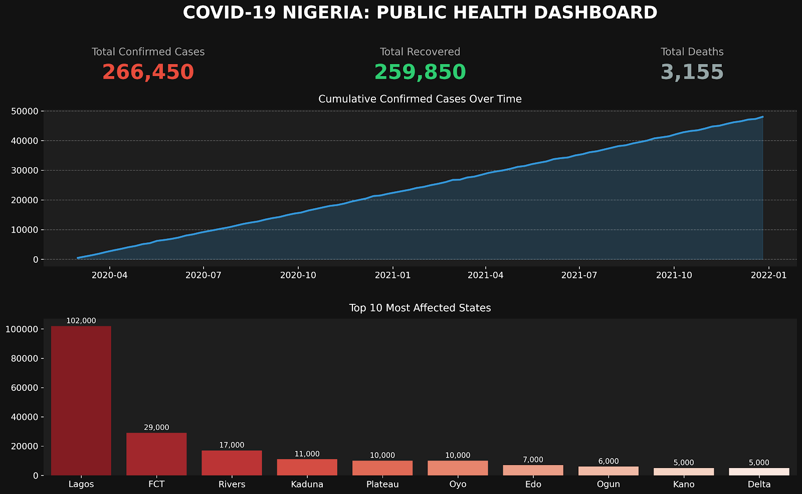

# COVID-19 Nigeria: Public Health Power BI Dashboard

## Overview
Built a comprehensive, interactive dashboard to analyze and visualize the impact of COVID-19 across Nigeria[cite: 12]. This project leverages a public health dataset, deliberately chosen to align with my background in biochemistry and my focus on healthcare data analytics[cite: 12].

## The Challenge: Dirty Data
Real-world data is rarely clean. During the initial ETL phase, the raw data presented a significant challenge:
* **Mixed Date Formats:** The date column contained two conflicting formats—standard text strings (e.g., `16/03/2020`) and Excel serial numbers (e.g., `43833`)[cite: 12].
* **Load Failures:** Attempting to ingest this directly into Power BI resulted in continuous `DataFormat.Error` flags[cite: 12].

## The Solution
To resolve the data ingestion issues and ensure robust data modeling:
1. **Excel Transformation:** I utilized Excel's 'Text to Columns' functionality to force all date cells into a standardized, clean 'DMY' format prior to loading[cite: 12]. 
2. **Power Query Filtering:** I used Power Query to clean up geographic anomalies, specifically filtering out the 'Grand Total' row from the Pivot Table, which was erroneously plotting as a data point in the United States[cite: 12].

## Dashboard Features & Tools
* **Visualizations:** Features a live map visual for geographic distribution, a time-series line chart for infection trends, and interactive summary cards for high-level KPIs[cite: 12].
* **Tools Used:** Power BI, Excel, Power Query, Pivot Tables[cite: 12].
